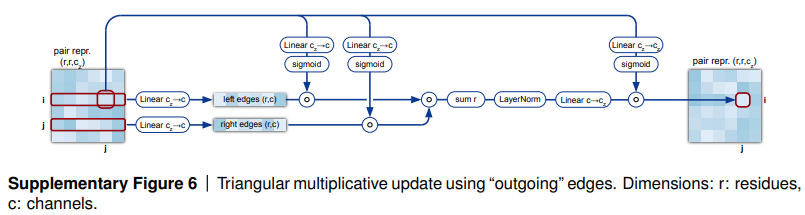

</img>

## Triangle Multiplicative Module - Pytorch

Implementation of the Triangle Multiplicative module, used in <a href="https://github.com/deepmind/alphafold"> Alphafold2</a> as an efficient way to mix rows or columns of a 2d feature map, as a standalone package for Pytorch

## Install

```bash
$ pip install triangle-multiplicative-module
```

## Usage

```python
import torch
from triangle_multiplicative_module import TriangleMultiplicativeModule

model = TriangleMultiplicativeModule(
    dim = 64,            # feature map dimension
    hidden_dim = 128,    # intermediate dimension size
    mix = 'outgoing'     # either 'ingoing' or 'outgoing'
)

fmap = torch.randn(1, 256, 256, 64)
mask = torch.ones(1, 256, 256).bool()

model(fmap, mask = mask) # (1, 256, 256, 64)
```

## Citations

```bibtex
@Article{AlphaFold2021,
    author  = {Jumper, John and Evans, Richard and Pritzel, Alexander and Green, Tim and Figurnov, Michael and Ronneberger, Olaf and Tunyasuvunakool, Kathryn and Bates, Russ and {\v{Z}}{\'\i}dek, Augustin and Potapenko, Anna and Bridgland, Alex and Meyer, Clemens and Kohl, Simon A A and Ballard, Andrew J and Cowie, Andrew and Romera-Paredes, Bernardino and Nikolov, Stanislav and Jain, Rishub and Adler, Jonas and Back, Trevor and Petersen, Stig and Reiman, David and Clancy, Ellen and Zielinski, Michal and Steinegger, Martin and Pacholska, Michalina and Berghammer, Tamas and Bodenstein, Sebastian and Silver, David and Vinyals, Oriol and Senior, Andrew W and Kavukcuoglu, Koray and Kohli, Pushmeet and Hassabis, Demis},
    journal = {Nature},
    title   = {Highly accurate protein structure prediction with {AlphaFold}},
    year    = {2021},
    doi     = {10.1038/s41586-021-03819-2},
    note    = {(Accelerated article preview)},
}
```
